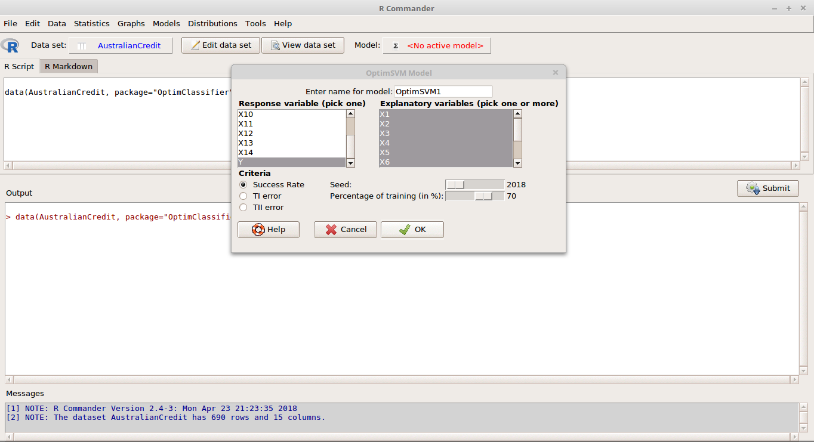

# Summary

The R Commander (``Rcmdr``) package [@Fox:2017] offers a point-and-click graphical user interface (GUI), despite to was originally conceived as a basic-statistics graphical user interface to R [@R:2018].

Nowadays, ``Rcmdr`` includes facilities for fitting, checking, and displaying many types of statistical models. With the introduction of plug-in packages, described in @Fox:2007, it is convenient to extend ``Rcmdr`` to include a range of additional features. As we write this, 56 ``Rcmdr`` plug-ins are available on CRAN and 17 ``Rcmdr`` plug-ins are available on GitHub.

The main goal of ``RcmdrPlugin.OptimClassifier`` is to provide a point-and-click GUI for the ``OptimClassifier`` package [@Perez:2018; @R:2018]. Each of the available statistical methods has inputs that we can optimize so that return output will improve with respect to default options. ``OptimClassifier`` is useful for obtaining the best parameters for a classification model for optimization and modelling.

``RcmdrPlugin.OptimClassifier`` currently provides dialogs for a toolbox of easy to use training models:

 - Linear Models (LM)
 - Generalized Linear Models (GLM)
 - Linear Mixed Models (LMM)
 - Discriminant Analysis (DA)
 - Classification And Regression Trees (CART)
 - Neural Networks (NN)
 - Support Vector Machines (SVM) 

The source code for ``RcmdrPlugin.OptimClassifier`` has been archived to Zenodo with the linked DOI: @zenodo and Github

# References
